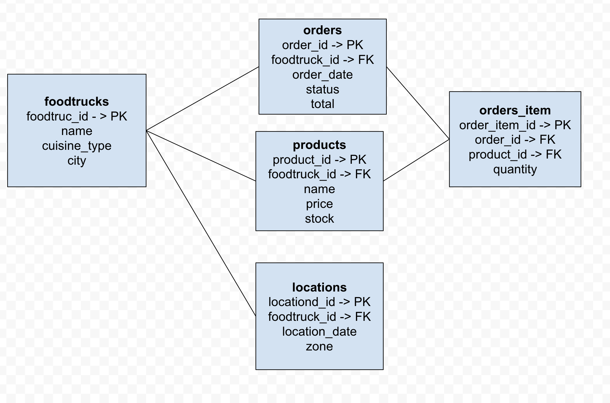

# FoodTrack Database

Proyecto académico de una base relacional para gestionar foodtrucks, productos, ubicaciones y pedidos. Se implementa con Microsoft SQL Server, se administra desde DBeaver y se versiona con Git y GitHub.

## Modelo relacional

Los datos de origen están en [`data/`](data/). El modelo contiene cinco entidades principales:

- `foodtrucks`: información de cada foodtruck.
- `products`: productos ofrecidos por cada foodtruck.
- `locations`: ubicación diaria de cada foodtruck.
- `orders`: pedidos asociados a un foodtruck.
- `order_items`: productos y cantidades incluidos en cada pedido.



La relación es: un foodtruck tiene muchos productos, pedidos y ubicaciones; un pedido tiene muchos ítems; y un producto puede aparecer en muchos ítems. La evolución del esquema agrega `comments` a `orders`.

## Estructura

```text
data/               CSV de origen
docs/               Diagrama y guías por sistema operativo
scripts/            Scripts SQL ordenados por ejecución
cargar_datos.py     Carga programática de orders y order_items
```

## Guías de ejecución

Elegí la guía según el sistema operativo. Ambas explican requisitos, conexión de Docker/DBeaver, carga con `BULK INSERT`, configuración de Python y validación final.

| Sistema operativo | Guía |
| --- | --- |
| macOS | [Guía para macOS](docs/guia-macos.md) |
| Windows | [Guía para Windows](docs/guia-windows.md) |

## Flujo de carga

1. Ejecutar los scripts de esquema en el orden indicado por la guía.
2. Cargar con SQL las tablas `foodtrucks`, `products` y `locations` mediante `scripts/05_load_data.sql`.
3. Cargar con Python `orders` y `order_items` mediante `cargar_datos.py`.
4. Ejecutar `scripts/06_validate_data.sql` y comprobar los conteos: 2 foodtrucks, 4 productos, 2 ubicaciones, 2 pedidos y 3 ítems.

`BULK INSERT` lee archivos desde el contenedor SQL Server, no desde DBeaver. Por eso las guías incluyen el paso de copiar los CSV al contenedor `sql_server_demo` en `/var/opt/mssql/import`.

## Tecnologías

- Microsoft SQL Server en Docker
- DBeaver
- Python 3 y `pyodbc`
- Git y GitHub
