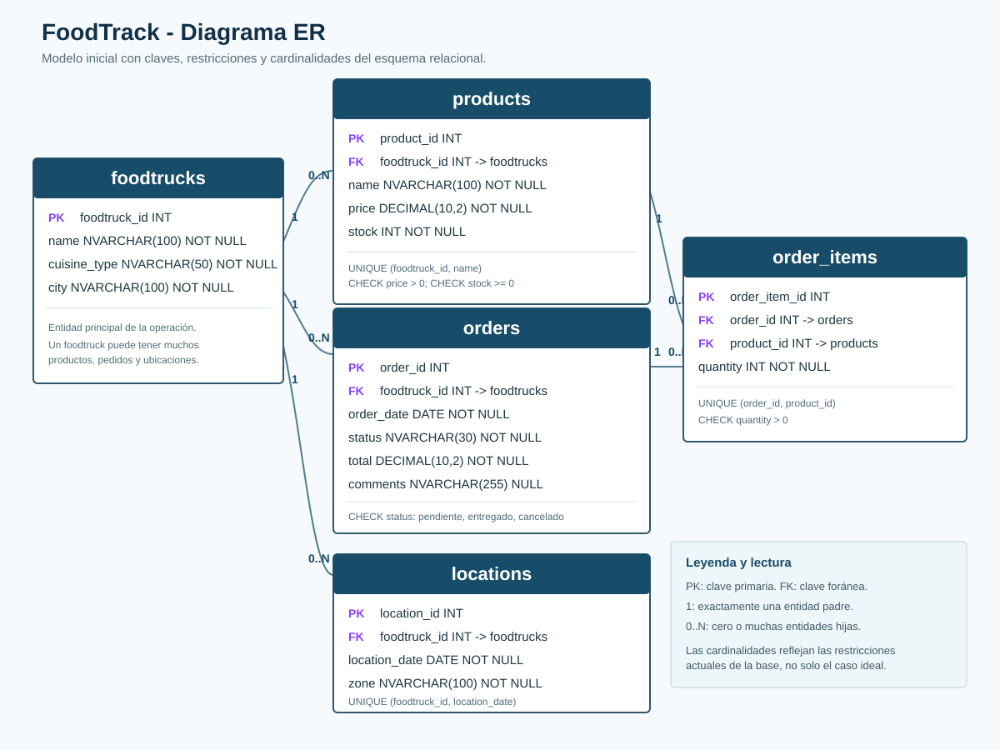

# FoodTrack Database

Proyecto académico de una base relacional para gestionar foodtrucks, productos, ubicaciones y pedidos. Se implementa con Microsoft SQL Server, se administra desde DBeaver y se versiona con Git y GitHub.

## Modelo relacional

Los datos de origen están en [`data/`](data/). El modelo contiene cinco entidades principales:

- `foodtrucks`: información de cada foodtruck.
- `products`: productos ofrecidos por cada foodtruck.
- `locations`: ubicación diaria de cada foodtruck.
- `orders`: pedidos asociados a un foodtruck.
- `order_items`: productos y cantidades incluidos en cada pedido.



La evolución del esquema agrega `comments` a `orders`. El análisis ampliado está en la [documentación del modelo](docs/modelo-negocio.md).

### Relaciones y cardinalidades

| Relación | Cardinalidad | Regla de negocio |
| --- | --- | --- |
| `foodtrucks` - `products` | 1 a 0..N | Cada producto pertenece a un único foodtruck. |
| `foodtrucks` - `orders` | 1 a 0..N | Cada pedido se realiza a un único foodtruck. |
| `foodtrucks` - `locations` | 1 a 0..N | Cada ubicación registrada pertenece a un único foodtruck. |
| `orders` - `order_items` | 1 a 0..N | Cada ítem pertenece a un único pedido. La base permite crear un pedido antes de agregar ítems. |
| `products` - `order_items` | 1 a 0..N | Cada ítem hace referencia a un único producto. |

El lado `0..N` indica que una entidad padre puede no tener registros relacionados todavía. Por ejemplo, un foodtruck puede existir sin productos cargados; la clave foránea protege que todo registro hijo tenga un padre válido.

### Restricciones del modelo

| Tabla | Restricciones principales |
| --- | --- |
| `foodtrucks` | Clave primaria en `foodtruck_id`; datos descriptivos obligatorios. |
| `products` | FK a `foodtrucks`; `UNIQUE (foodtruck_id, name)`; precio mayor a cero; stock no negativo. |
| `orders` | FK a `foodtrucks`; total no negativo; estado permitido: `pendiente`, `entregado` o `cancelado`; `comments` opcional. |
| `locations` | FK a `foodtrucks`; `UNIQUE (foodtruck_id, location_date)` para evitar dos ubicaciones diarias del mismo foodtruck. |
| `order_items` | FK a `orders` y `products`; `UNIQUE (order_id, product_id)`; cantidad mayor a cero. |

### Patrones de negocio implícitos

- **Catálogo por foodtruck:** cada foodtruck maneja sus productos y su stock.
- **Operación móvil:** las ubicaciones permiten conocer la zona en la que opera un foodtruck cada día.
- **Patrón cabecera-detalle:** `orders` guarda la información general del pedido y `order_items` sus líneas de compra.
- **Ciclo de vida del pedido:** `status` conserva el estado operativo sin eliminar el historial.
- **Evolución versionada:** la columna `comments` es una modificación estructural independiente del esquema inicial.

### Mejoras recomendadas

| Mejora | Justificación |
| --- | --- |
| Agregar `unit_price` a `order_items` | Conserva el precio vendido cuando el precio actual del producto cambia y permite reconstruir el total histórico. |
| Validar que producto y pedido sean del mismo foodtruck | La estructura actual podría permitir asociar un producto de otro foodtruck; se puede reforzar con claves compuestas o un trigger. |
| Calcular o validar `orders.total` | Se debe definir si el total incluye impuestos, descuentos o costos adicionales, y verificarlo contra los ítems. |
| Crear `stock_movements` | Permite auditar ventas, ingresos, ajustes y devoluciones en lugar de conservar solo el stock actual. |
| Ampliar `locations` con horarios o coordenadas | Diferencia turnos y posiciones precisas cuando una zona no es suficiente. |

## Estructura

```text
data/               CSV de origen
docs/               Diagrama y guías por sistema operativo
scripts/            Scripts SQL ordenados por ejecución
cargar_datos.py     Carga programática de orders y order_items
```

## Guías de ejecución

Elegí la guía según el sistema operativo. Ambas explican requisitos, conexión de Docker/DBeaver, carga con `BULK INSERT`, configuración de Python y validación final.

| Sistema operativo | Guía |
| --- | --- |
| macOS | [Guía para macOS](docs/guia-macos.md) |
| Windows | [Guía para Windows](docs/guia-windows.md) |

## Alternativas de importación CSV

La entrega oficial usa SQL Server. Si el docente autoriza trabajar con otro motor, estas guías explican cómo importar los mismos CSV; no reemplazan los scripts ni la automatización diseñados para SQL Server.

| Motor alternativo | Método nativo | Guía |
| --- | --- | --- |
| PostgreSQL | `\copy` / `COPY FROM` | [Guía para PostgreSQL](docs/guia-postgresql.md) |
| MySQL | `LOAD DATA LOCAL INFILE` | [Guía para MySQL](docs/guia-mysql.md) |

## Flujo de carga

1. Ejecutar los scripts de esquema en el orden indicado por la guía.
2. Cargar con SQL las tablas `foodtrucks`, `products` y `locations` mediante `scripts/05_load_data.sql`.
3. Cargar con Python `orders` y `order_items` mediante `cargar_datos.py`.
4. Ejecutar `scripts/06_validate_data.sql` y comprobar los conteos: 2 foodtrucks, 4 productos, 2 ubicaciones, 2 pedidos y 3 ítems.
5. Ejecutar por último `scripts/07_create_failed_orders.sql` como extra independiente.

`BULK INSERT` lee archivos desde el contenedor SQL Server, no desde DBeaver. Por eso las guías incluyen el paso de copiar los CSV al contenedor `sql_server_demo` en `/var/opt/mssql/import`.

## Tecnologías

- Microsoft SQL Server en Docker
- DBeaver
- Python 3 y `pyodbc`
- Git y GitHub
