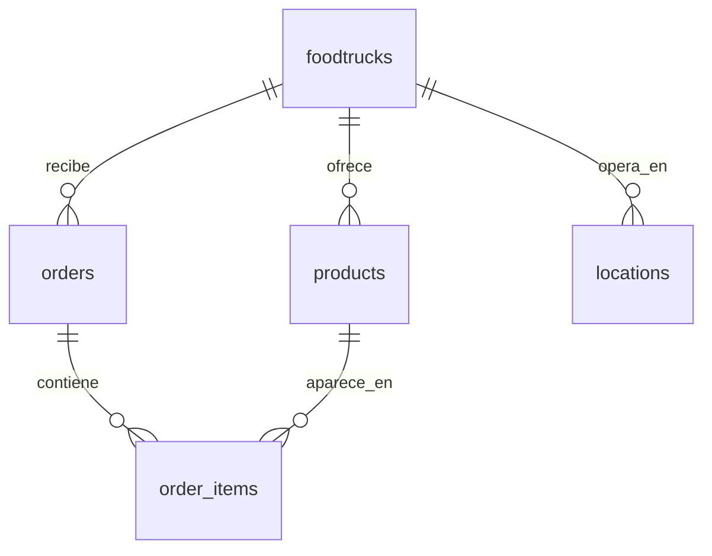

# FoodTrack Database

Proyecto académico de una base relacional para gestionar foodtrucks, sus productos, ubicaciones y pedidos. El motor objetivo es **Microsoft SQL Server** y **DBeaver** se utiliza como cliente de consulta.

## Modelo

El modelo se deriva de los CSV provistos en [`data/`](data/). Sus relaciones son:

- Un foodtruck tiene muchos productos, pedidos y ubicaciones.
- Un pedido tiene muchos ítems.
- Un producto puede aparecer en muchos ítems de pedido.


El script define `location_id` como clave primaria de `locations`. La columna `comments` es una evolución posterior del modelo, por eso no forma parte del diagrama base.



## Estructura

```text
data/       CSV de origen
docs/       Diagrama ER
scripts/    Scripts SQL ordenados por ejecución
cargar_datos.py  Carga programática de pedidos
```

## Ejecución en SQL Server con DBeaver

Abrí una conexión a SQL Server en DBeaver y ejecutá los archivos de `scripts/` en este orden:

1. `01_create_database.sql` — conectado a `master`.
2. `02_create_tables.sql`
3. `03_constraints.sql`
4. `04_schema_update.sql`
5. `07_create_failed_orders.sql` — necesario para el extra de Python.
6. `05_load_data.sql` — usa la ruta `/var/opt/mssql/import`, por lo que el contenedor SQL Server debe tener montada allí la carpeta `data/` del proyecto. Carga las tres tablas base; sus bloques `orders` y `order_items` están comentados.
7. Elegí una de estas rutas para las dos tablas finales:
   - **BULK INSERT:** descomentá y ejecutá primero el bloque `orders`, luego el bloque `order_items` de `05_load_data.sql`.
   - **Python:** ejecutá `cargar_datos.py`; carga primero `orders` y luego `order_items`.
8. `06_validate_data.sql`

La carga completa espera los conteos: 2 foodtrucks, 4 productos, 2 ubicaciones, 2 pedidos y 3 ítems. Las restricciones impiden precios no positivos, stock negativo, cantidades no positivas, totales negativos y estados de pedido no permitidos.

> `BULK INSERT` lee archivos desde el contenedor donde se ejecuta SQL Server, no desde DBeaver. Si no montaste `/var/opt/mssql/import`, usá el asistente de importación de DBeaver o configurá un volumen compartido.

### Copiar los CSV a Docker

El contenedor usado en este proyecto se llama `sql_server_demo` y los scripts esperan los archivos en `/var/opt/mssql/import`. Desde Terminal, ejecutá una sola vez:

```bash
docker cp "/Users/saragallegomunoz/Documents/Henry/Data Science/M2/Clase 1/foodtrack-db/data/." sql_server_demo:/var/opt/mssql/import
```

Comprobá que se copiaron los cinco CSV:

```bash
docker exec sql_server_demo ls -l /var/opt/mssql/import
```

Luego ejecutá `05_load_data.sql` desde DBeaver. El nombre `sql_server_demo` se usa solamente en los comandos de Docker; no aparece dentro de `BULK INSERT` porque SQL Server ya se está ejecutando en ese contenedor.

## Carga programática con Python

El extra `cargar_datos.py` inserta `data/orders.csv` y `data/order_items.csv`, en ese orden, y registra cada fallo en `dbo.failed_orders`. Es la vía prevista para cargar las dos tablas finales; si preferís `BULK INSERT`, descomentá ambos bloques de `05_load_data.sql` y omití esta ejecución.

```bash
python3 -m venv .venv
source .venv/bin/activate
python -m pip install -r requirements.txt
cp .env.example .env
python cargar_datos.py
```

Completá `.env` con los datos de tu instancia SQL Server. Este archivo está ignorado por Git y no debe publicarse. Antes de ejecutar Python, corré `01` a `04` y `07`, y cargá manualmente `foodtrucks`, `products` y `locations`. Python cargará las dos tablas restantes.

Para usar otro archivo de pedidos:

```bash
python cargar_datos.py --orders-file /ruta/a/orders.csv --items-file /ruta/a/order_items.csv
```

## Tecnologías

- Microsoft SQL Server
- DBeaver
- Git y GitHub
- Python 3 y `pyodbc`
